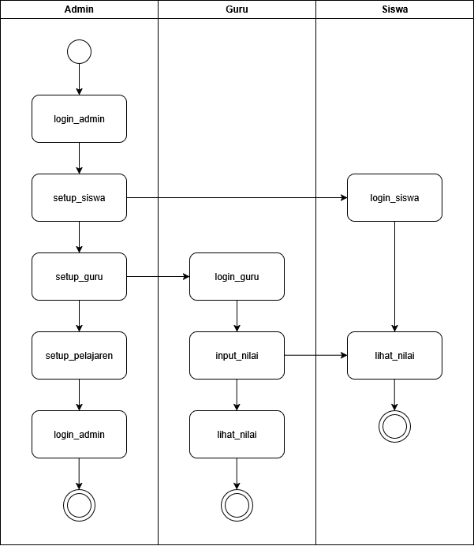
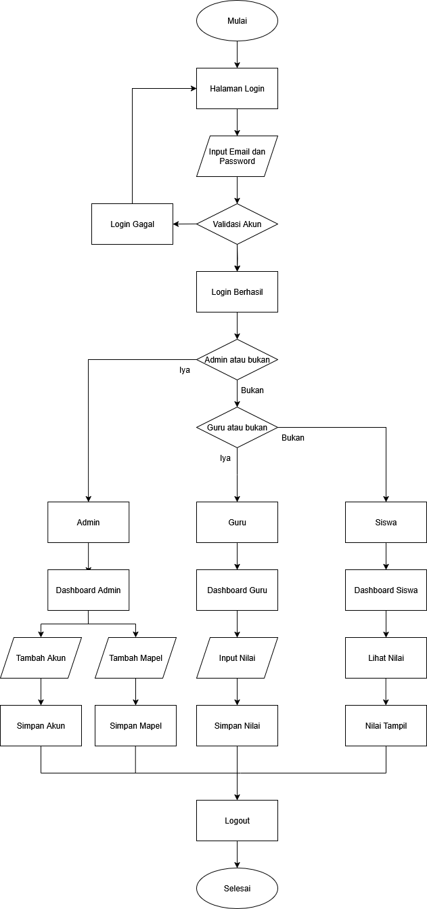
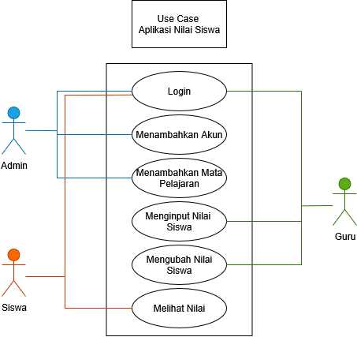
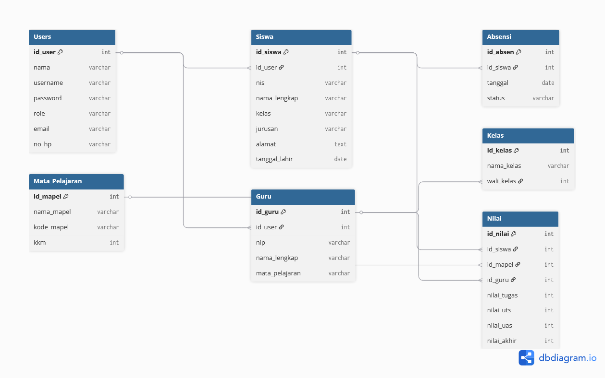
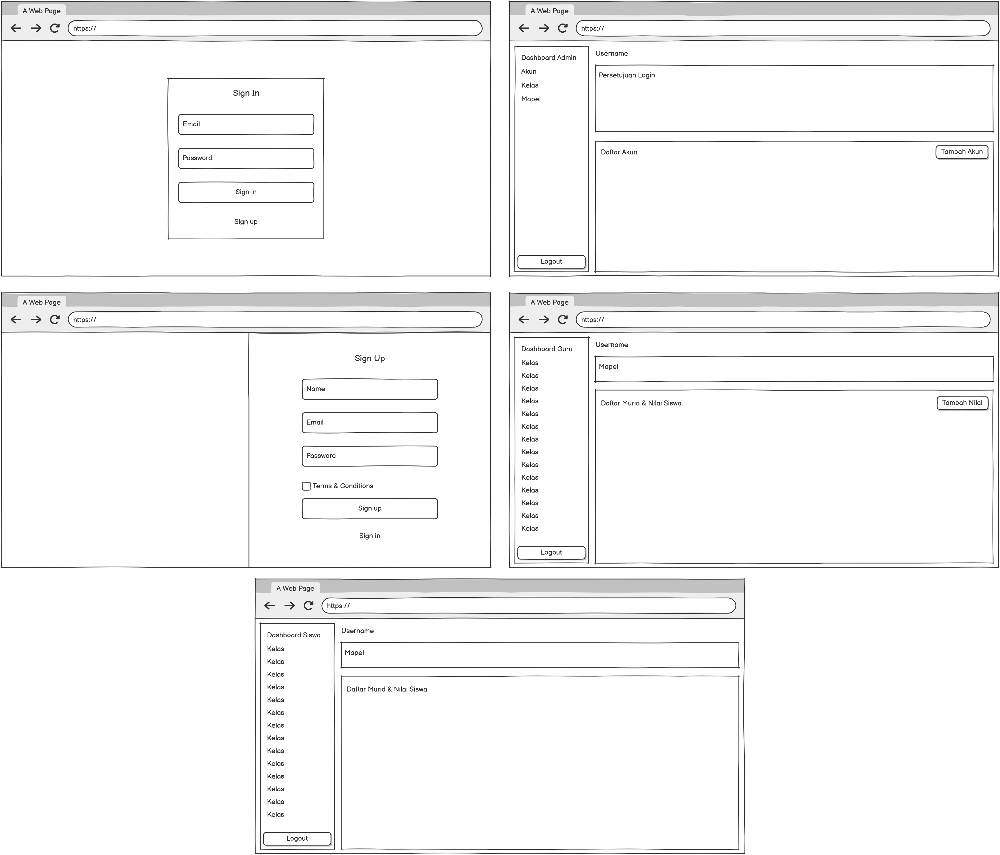

# 📚 Aplikasi Nilai Siswa

Aplikasi **Nilai Siswa** adalah sistem manajemen nilai berbasis web yang memudahkan proses **input, pengolahan, dan pelaporan nilai akademik** di sekolah.  
Dengan adanya aplikasi ini, proses administrasi nilai menjadi lebih cepat, transparan, dan efisien.  

Aplikasi ini mendukung **tiga level pengguna**: **Admin**, **Guru**, dan **Siswa**, dengan hak akses berbeda sesuai peran masing-masing.

---

## 🚀 Fitur Utama

- 🔐 **Login Multi-Level** (Admin, Guru, Siswa)  
- 👩‍🏫 **Manajemen Data Guru & Siswa**  
- 📝 **Input & Pengolahan Nilai oleh Guru**  
- 📑 **Rekap & Cetak Nilai Raport**  
- 👨‍🎓 **Siswa Melihat Nilai Secara Real-Time**  
- 🔔 **Sistem Notifikasi & Catatan Tambahan**  

---

## 👥 Jenis-Jenis Level Pengguna

### 1. **Admin**
Sebagai pengguna dengan **hak akses tertinggi**.  
Fitur yang dapat diakses:
- Menambahkan, mengedit, dan menghapus data guru & siswa  
- Membuat akun pengguna (guru & siswa)  
- Mengatur mata pelajaran & tahun ajaran  
- Melihat semua data nilai dan laporan  
- Backup & restore database  

---

### 2. **Guru**
Sebagai pengguna yang bertugas mengelola nilai siswa.  
Fitur yang dapat diakses:
- Login & melihat dashboard pribadi  
- Input & edit nilai siswa sesuai mata pelajaran yang diampu  
- Menambahkan catatan/komentar pembelajaran siswa  
- Melihat rekap nilai kelas yang diajarkan  

---

### 3. **Siswa**
Sebagai pengguna akhir yang hanya melihat nilai mereka sendiri.  
Fitur yang dapat diakses:
- Login & melihat dashboard pribadi  
- Melihat nilai setiap mata pelajaran  
- Melihat komentar/catatan dari guru  
- Mencetak nilai pribadi (jika diizinkan)  

---

## 🖼️ Dokumentasi Visual

### 📌 Activity Diagram

### 📌 Flowchart

### 📌 Use Case Diagram

### 📌 Database Diagram

### 📌 Tampilan Website

